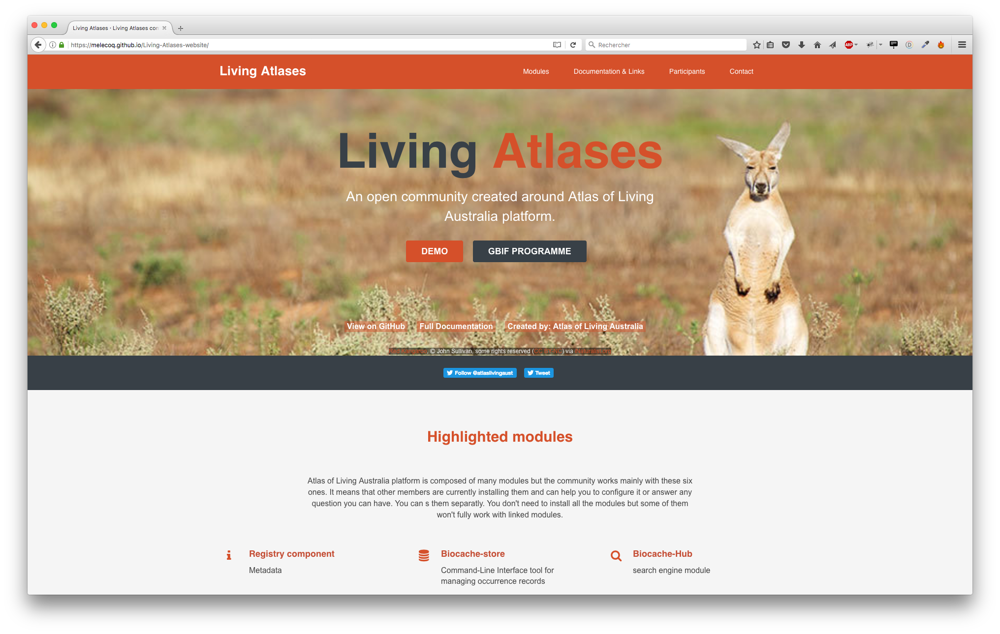

#  **Living Atlases** official website

<p align="center">
  
</p>

Official **Living Atlases** website using Jekyll and based on [devAid](https://github.com/xriley/devAid-Theme) theme from [Xiaoying Riley](http://xiaoyingriley.com/). 


## Installation

1. Install [Jekyll](https://jekyllrb.com/),
2. Clone this repo onto your computer,
3. Comment baseUrl and URL on the _config file 

```
# For local development, comment these lines and uncomment the two other lines.
url: "URL"     
baseurl: "BASEURL"   

# For production, comment these lines and uncomment the two lines above.
url:    
baseurl:   
```

## Data

### Participants

#### Living Atlases

To add an institution to the existing list, you need to enter the below information for the new described data portal in `_data\participants.yml` file. 
We try to keep an ordered list using institution name.

```
- institution: <institution_name>
  data-portal: <data_portal_url> (can be empty)
  gbif-page: <data_portal_gbif_page_url> (cen be empty)
  country: <country>
  language: <language(s)>
  status: "In production", "In progress" or "In discussion"
```

#### The community in action
